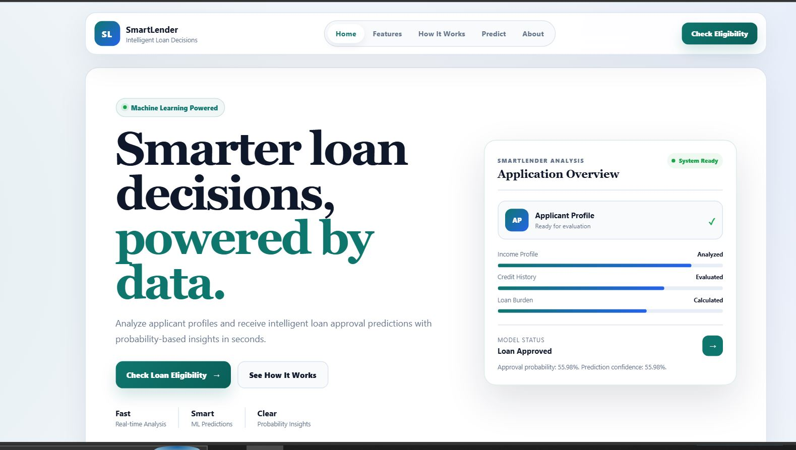
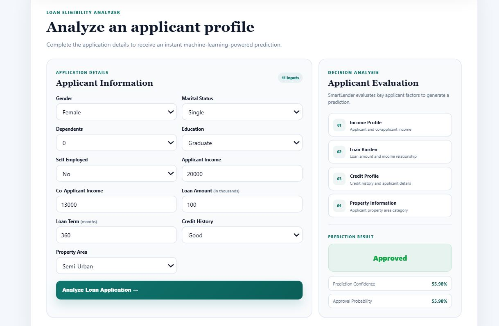
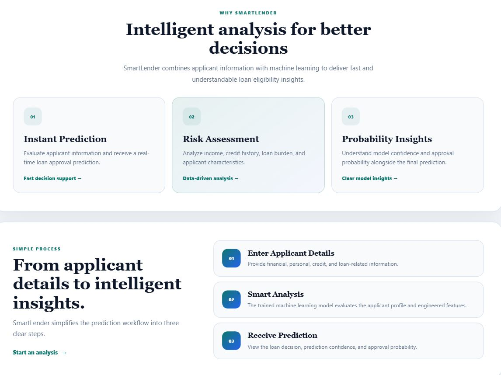

# 🏦 Smart Lender — Loan Eligibility Prediction System

<div align="center">

### Machine Learning-Powered Loan Eligibility Analysis & Decision Support Platform

Smart Lender is an end-to-end machine learning web application that analyzes applicant profiles and predicts loan eligibility through a responsive, interactive decision-support interface.

<br>


<br>

### 🔗 Project Links

[] https://smart-lender-credit-eligiblity-1.onrender.com

[] https://github.com/Pranavi7777/smart_lender_credit_eligiblity

[]
https://drive.google.com/file/d/19RYqKajJ6J-OMd2v-9A15cyXmCfVBLjk/view

</div>

---

## 📌 Overview

**Smart Lender** is a machine learning-powered loan eligibility prediction platform designed to demonstrate how data-driven systems can support financial decision-making workflows.

The application accepts structured applicant information such as income, loan amount, credit history, education, employment status, dependents, and property area.

The submitted applicant profile is processed by a trained machine learning model through a Flask backend. The system then returns:

- Loan approval or rejection prediction
- Prediction confidence
- Approval probability
- Interactive decision analysis

The project integrates the complete machine learning lifecycle — from data preprocessing and exploratory analysis to model comparison, feature engineering, model deployment, and frontend integration.

> **Smart Lender is designed as a machine learning decision-support project and not as a replacement for real-world financial underwriting systems.**

---

## ✨ Key Features

| Feature | Description |
|---|---|
| 🤖 Machine Learning Prediction | Predicts applicant loan eligibility using a trained classification model |
| 📊 Model Comparison | Evaluates multiple machine learning classification algorithms |
| ⚙️ Automated Model Selection | Selects the best-performing candidate model based on evaluation performance |
| 🧠 Feature Engineering | Generates additional financial indicators from the original applicant data |
| ⚡ Real-Time Analysis | Sends applicant data to the Flask API and returns predictions instantly |
| 📈 Probability Insights | Displays approval probability and prediction confidence |
| 💻 Product-Style Interface | Responsive and interactive loan analysis workspace |
| 🔄 End-to-End ML Pipeline | Connects data preprocessing, training, model persistence, backend, and frontend |

---

## 🖥️ Application Preview

### 🏠 Smart Lender Home Page

<p align="center">
  
</p>

The landing interface introduces the Smart Lender platform, machine learning workflow, and application capabilities through a modern product-style experience.

---

### 💳 Loan Eligibility Analyzer

<p align="center">
  
</p>

Applicants can enter 11 profile attributes and receive an instant machine learning prediction with confidence and approval probability.

---

### ⚙️ Machine Learning Workflow

<p align="center">
  
</p>

The project follows an end-to-end workflow from applicant data preprocessing and feature engineering to model evaluation, persistence, and Flask deployment.

---

## 🏗️ System Architecture

```text
                    ┌─────────────────────────┐
                    │   Loan Applicant Data   │
                    └────────────┬────────────┘
                                 │
                                 ▼
                    ┌─────────────────────────┐
                    │   Data Preprocessing    │
                    │                         │
                    │  • Missing Values       │
                    │  • Categorical Encoding │
                    │  • Data Transformation  │
                    └────────────┬────────────┘
                                 │
                                 ▼
                    ┌─────────────────────────┐
                    │    Feature Engineering  │
                    │                         │
                    │  • Total Income         │
                    │  • Income/Loan Ratio    │
                    │  • Loan Amount Log      │
                    │  • Total Income Log     │
                    └────────────┬────────────┘
                                 │
                                 ▼
              ┌──────────────────────────────────────┐
              │          Model Comparison            │
              │                                      │
              │  Decision Tree    Random Forest      │
              │  KNN              Gradient Boosting  │
              │  XGBoost                             │
              └──────────────────┬───────────────────┘
                                 │
                                 ▼
                    ┌─────────────────────────┐
                    │   Best Model Selection  │
                    │       F1 Score          │
                    └────────────┬────────────┘
                                 │
                                 ▼
                    ┌─────────────────────────┐
                    │     best_model.pkl      │
                    └────────────┬────────────┘
                                 │
                                 ▼
                    ┌─────────────────────────┐
                    │      Flask Backend      │
                    │                         │
                    │   /predict   /health    │
                    └────────────┬────────────┘
                                 │
                                 ▼
                    ┌─────────────────────────┐
                    │     Smart Lender UI     │
                    │                         │
                    │   HTML • CSS • JS       │
                    └─────────────────────────┘
```

---

## 🔄 Project Workflow

```text
Dataset
   ↓
Exploratory Data Analysis
   ↓
Data Preprocessing
   ↓
Categorical Encoding
   ↓
Missing Value Handling
   ↓
Feature Engineering
   ↓
Train-Test Split
   ↓
Train Multiple ML Models
   ↓
Model Evaluation
   ↓
Best Model Selection
   ↓
Model Serialization
   ↓
Flask API Integration
   ↓
Interactive Web Application
   ↓
Loan Eligibility Prediction
```

---

## 🧠 Machine Learning Pipeline

### 1️⃣ Data Preprocessing

The original dataset contains applicant demographic, financial, and credit-related attributes.

The preprocessing pipeline performs:

- Categorical feature encoding
- Missing value handling
- Dependent value transformation
- Numerical feature preparation
- Target variable encoding

---

### 2️⃣ Feature Engineering

The system generates additional features to improve the representation of applicant financial profiles.

#### Total Income

```text
TotalIncome = ApplicantIncome + CoapplicantIncome
```

#### Income-to-Loan Ratio

```text
IncomeToLoanRatio = TotalIncome / LoanAmount
```

#### Log-Transformed Loan Amount

```text
LoanAmountLog = log(1 + LoanAmount)
```

#### Log-Transformed Total Income

```text
TotalIncomeLog = log(1 + TotalIncome)
```

These engineered features help the models capture relationships between applicant income and requested loan amount.

---

### 3️⃣ Model Training and Comparison

Smart Lender compares five classification algorithms:

| Model | Purpose |
|---|---|
| Decision Tree | Tree-based classification baseline |
| Random Forest | Ensemble learning using multiple decision trees |
| K-Nearest Neighbors | Distance-based classification |
| Gradient Boosting | Sequential ensemble learning |
| XGBoost | Optimized gradient boosting classification |

Each candidate model is trained using the same training and testing data split.

The models are evaluated using classification metrics, including:

- Accuracy
- F1 Score
- Confusion Matrix
- Classification Report

---

### 4️⃣ Best Model Selection

The training pipeline compares candidate models and selects the model with the highest F1 score.

```text
Decision Tree ────────┐
                      │
Random Forest ────────┤
                      │
KNN ──────────────────┼──► Model Evaluation ──► Best Model
                      │
Gradient Boosting ────┤
                      │
XGBoost ──────────────┘
```

The selected model is serialized as:

```text
final model/best_model.pkl
```

The Flask application loads this artifact when the server starts.

---

## 📥 Model Inputs

The machine learning model evaluates 11 applicant inputs.

| Input Feature | Description |
|---|---|
| Gender | Applicant gender |
| Married | Marital status |
| Dependents | Number of dependents |
| Education | Graduate or non-graduate |
| Self Employed | Employment category |
| Applicant Income | Primary applicant income |
| Co-Applicant Income | Co-applicant income |
| Loan Amount | Requested loan amount |
| Loan Amount Term | Loan repayment period |
| Credit History | Applicant credit history |
| Property Area | Rural, semi-urban, or urban property location |

---

## 📤 Prediction Output

After analyzing the applicant profile, Smart Lender displays:

```text
Prediction Result
        │
        ├──► Approved / Rejected
        │
        ├──► Prediction Confidence
        │
        └──► Approval Probability
```

Example:

```text
Prediction Result: Approved

Prediction Confidence: 55.98%

Approval Probability: 55.98%
```

---

## 🛠️ Technology Stack

### Machine Learning & Data Science

<p>


</p>

### Data Analysis & Visualization

<p>


</p>

### Backend Development

<p>


</p>

### Frontend Development

<p>


</p>

### Development Tools

<p>


</p>

---

## 📂 Project Structure

```text
SMARTLENDER/
│
├── assets/
│   ├── home.JPG
│   ├── loan_eligibility.JPG
│   └── working_process.JPG
│
├── dataset/
│   └── loan_prediction.xlsx
│
├── final model/
│   └── best_model.pkl
│
├── static/
│   ├── script.js
│   └── style.css
│
├── templates/
│   └── index.html
│
├── training model/
│   └── training.ipynb
│
├── app.py
├── retrain_models.py
├── README.md
└── requirements.txt
```

---

## 🚀 Run the Project Locally

### 1️⃣ Clone the Repository

```bash
git clone ADD_GITHUB_REPOSITORY_LINK_HERE
```

### 2️⃣ Navigate to the Project Directory

```bash
cd smartlender
```

### 3️⃣ Create a Virtual Environment

```bash
python -m venv .venv
```

### 4️⃣ Activate the Virtual Environment

#### Windows

```powershell
.venv\Scripts\activate
```

#### Linux / macOS

```bash
source .venv/bin/activate
```

### 5️⃣ Install Dependencies

```bash
pip install -r requirements.txt
```

### 6️⃣ Retrain the Machine Learning Models

Run this step when the dataset, feature engineering, or model configuration changes.

```bash
python retrain_models.py
```

The best-performing model will be saved as:

```text
final model/best_model.pkl
```

### 7️⃣ Start the Flask Application

```bash
python app.py
```

### 8️⃣ Open the Application

Open the following address in your browser:

```text
http://127.0.0.1:5000
```

---

## 🔌 API Endpoints

| Endpoint | Method | Description |
|---|---|---|
| `/` | GET | Loads the Smart Lender application |
| `/predict` | POST | Processes applicant data and returns the ML prediction |
| `/health` | GET | Checks backend and model availability |

---

## 💡 Use Cases

### 🟢 Applicant Eligibility Screening

Analyze structured applicant information and generate an immediate machine learning prediction.

### 🟠 Risk Identification

Identify applicant profiles that the trained model associates with a lower probability of loan approval.

### 🔵 Machine Learning Decision Support

Demonstrate how classification models can be integrated into interactive financial technology applications.

---

## 👥 Project Team

| Role | Name |
|---|---|
| Team Lead | Kaligineedi Dhanush |
| Member | Karumuri Sai Pranavi |
| Member | R Rohith Siva Sai Krishna |
| Member | Tulasi Vijaya Dharma Teja Koppada |
| Member | Anitha Myla |

---

## 🎓 Project Context

This project was developed as part of the **SmartBridge Artificial Intelligence and Machine Learning Internship Program**.

The project demonstrates practical implementation of:

- Data preprocessing
- Exploratory data analysis
- Feature engineering
- Classification algorithms
- Model comparison
- Model evaluation
- Model serialization
- Flask backend development
- REST-style API integration
- Responsive frontend development
- End-to-end machine learning deployment

---

## 🔮 Future Enhancements

- Add explainable AI using SHAP or feature importance analysis
- Improve probability calibration
- Introduce cross-validation for more robust model comparison
- Add hyperparameter optimization
- Implement secure user authentication
- Add application history and prediction tracking
- Build an administrative analytics dashboard
- Containerize the application using Docker
- Deploy the production application to a cloud platform

---

## ⚠️ Disclaimer

Smart Lender is an educational machine learning project developed for academic and internship purposes.

Predictions are generated from a trained machine learning model and should not be used as the sole basis for real-world financial, lending, or credit decisions.

---

## 📬 Project Links

| Resource | Link |
|---|---|
| 🌐 Live Application | https://smart-lender-credit-eligiblity-1.onrender.com |
| 💻 GitHub Repository | https://github.com/Pranavi7777/smart_lender_credit_eligiblity |
| 🎥 Demo Video |https://drive.google.com/file/d/19RYqKajJ6J-OMd2v-9A15cyXmCfVBLjk/view |

---

<div align="center">

### 🏦 Smart Lender

**Machine Learning-Powered Loan Eligibility Analysis**

Built with Python • Machine Learning • Flask • JavaScript

<br>

⭐ If you find this project useful, consider giving the repository a star.

</div>
